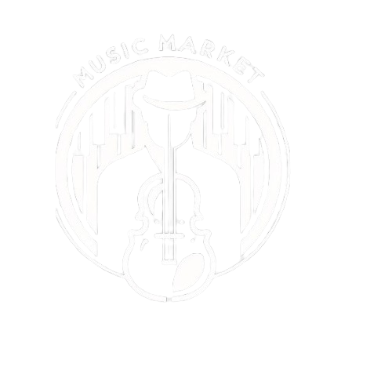

**Running the Program**

To start the program on Windows, open two Bash terminals. In the first terminal, run the following command to start the development server:

```bash
npm run dev
```

In the second terminal, run the following command to start the JSON server:

```bash
npx json-server public/data/dataBase.json
```

---

# Music Market



## Our Team

- [Alexis Soto](https://github.com/sotomen10)

## Mock-up and Work Dawsboard

- Trello: [Our Trello](https://trello.com/invite/b/djk4SDLl/ATTI6de6b47d91ba7fb2fb84419121ee10c04BA8770D/proyecto-quevec)
- Figma: [Our Figma](https://www.figma.com/design/5YyJVxJ9xeZhJcb6MtKW49/Project-Quevec?node-id=1669-162202&t=42m1EY9EbXhkF3ai-1)

## Starting Point

In the world of music, artists who are dedicated to this profession usually don't have a portfolio to offer their services to potential employers or companies that can hire them. With the prevalence of live events, every day there are events that need good musicians and music. Often, when looking for live music for some events (whether small or large scale), both parties face a problem:

- Musicians don’t have a portfolio of their services, showcasing the music they play.
- Employers and companies don’t have any idea of the musician they are hiring, when there may be better options that fit their event better.

In **Music Market**, our objective is to be the connection between musicians and new opportunities to play their music and make themselves known. The **Music Market** platform provides an opportunity to sell musical services on both small and large scales, where potential contractors can have a reference that will encourage them to hire the services of these musicians who will have their profiles on our platform.

## Functionalities

- The page will allow entrepreneurs to create their profiles and search for the musical proposal that best fits their needs or profile.
- Each business owner or contractor will be able to request quotes based on their event's requirements.
- Musicians will have the ability to create a portfolio that will be public on our website and will allow them to connect with potential contractors for small or large events in the music industry.
- On the home page, there will be a section containing an initial mosaic cover featuring a photo of the band or soloist. Clicking on it will provide information about the type of music and name, encouraging and enticing users to request a quote with this artist.

- Creation of user profiles (band or soloist)
- Creation of company or contractor profiles

For more information about the project: [More info](https://drive.google.com/file/d/1HXdfwgw4P_JFh6LPYWoSLTYMxucD0tAy/view?usp=sharing)

---